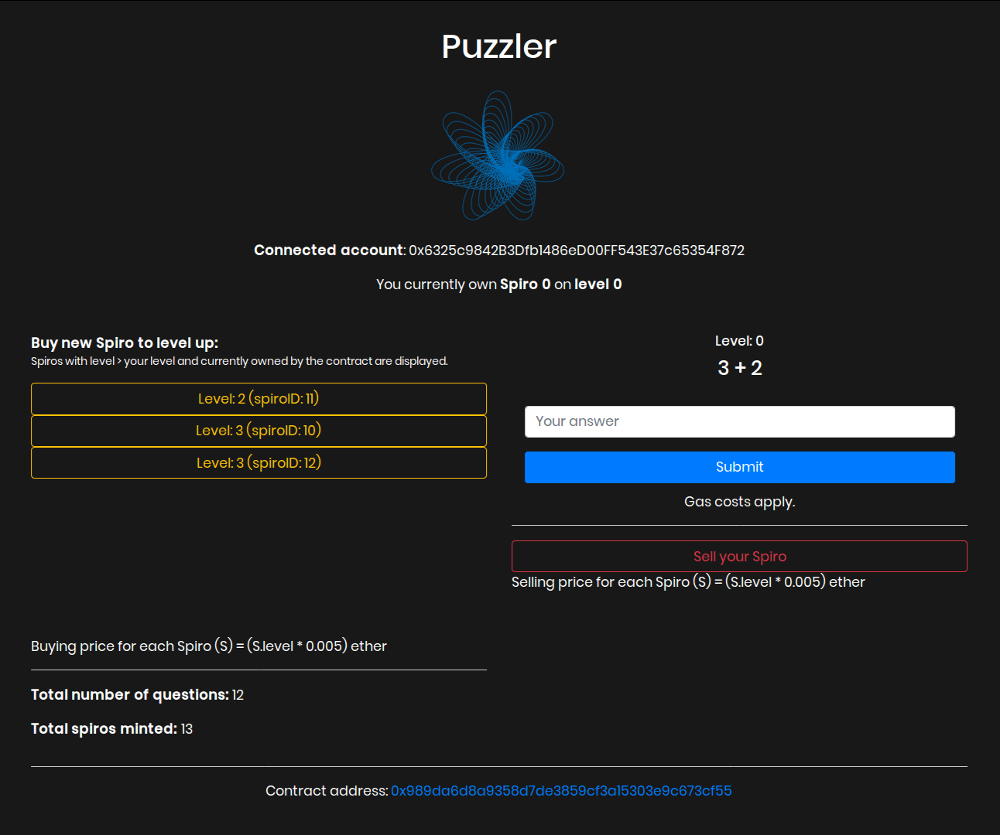

# Puzzler :game_die:

A simple Ethereum based decentralized application demonstrating usage of ERC-721 tokens.



## Description

- Answering questions would increment the level for the user.
- Each puzzle solved mints an ERC-721 token (PZLR), which is owned by the smart contract. Called 'Spiro' in the game.
- Each Spiro is representative of: 
  - creator 
  - level at which it was created
- User has an option to either:
  - freeze his/her progress (level) by buying the spiro
  - sell the spiro he/she owns.
  - buy another spiro - of a higher level
- Contract is currently deployed on Ropsten Testnet


## Running It Locally

Clone this repo via to your local machine and install the dependencies by doing the following:

```bash
git clone https://github.com/nglglhtr/puzzler.git
cd puzzler
npm i
```
Serve the application

```bash
npm run dev
```
Switch to Ropsten Testnet on Metamask

## Built With

* [Solidity](https://solidity.readthedocs.io/en/v0.5.3/) - v0.5.3
* [Vue.js](https://vuejs.org/) 
* [Metamask](https://metamask.io/)
* [web3.js](https://github.com/ethereum/web3.js/)
